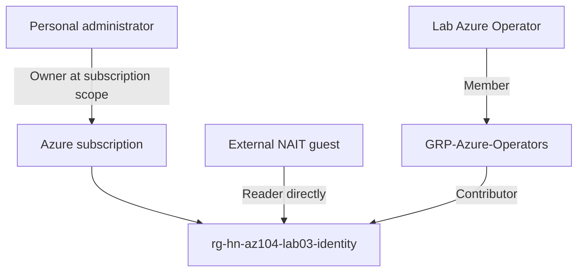

# Lab03 — Microsoft Entra ID & Identity Management

Azure AZ-104 portfolio lab: B2B guest access, group-based Azure RBAC, access testing and adoption of existing role assignments with Bicep.

**Status:** portal tests, CLI verification and Bicep deployment completed on 5 September 2026. This lab does not claim that all Entra identity features have been implemented.

## Problem
Provide an external user with read-only access and an internal operator with resource-management access to a single lab resource group, while keeping subscription administration separate.

## Architecture


The resource group is in Canada Central, in the personal HN Azure Identity Lab directory. The guest authenticates with an external identity; authorization to Azure resources is granted in the lab tenant. Entra Global Administrator and Azure RBAC Owner are separate roles.

## Implementation
1. Created and tested a lab emergency administrator; created an operator and a security group in Entra ID.
2. Added the operator as a member and the administrator as group owner.
3. Granted Reader directly to the guest at resource-group scope.
4. Granted Contributor to the operators group at the same scope.
5. Tested the identities in separate browser sessions.
6. Verified role assignments, parent scopes and group membership through Azure CLI.
7. Deployed two existing RBAC assignments with Bicep, preserving their assignment names.

The CLI phase verified the portal configuration; it did not recreate it. The Bicep template manages only Azure role assignments. It does not create the tenant, subscription, resource group, users or group.

## Validation
| Check | Observed result |
|---|---|
| Guest opens resource group and reads tags | Passed |
| Guest writes Reader-Test=Should-Fail | AuthorizationFailed; change not saved |
| Operator gets Contributor through group | Confirmed in IAM and CLI |
| Operator writes RBAC-Test=Operator-Write-OK | Saved successfully |
| Activity Log identifies operator Write tags action | Succeeded |
| Administrator role inherited from subscription | Owner |
| Bicep what-if | 2 no change |
| Deployment lab03-rbac-bicep | Succeeded |

See [validation notes](docs/validation.md). These are transcriptions of the session evidence, not freshly collected API results.

## What broke and why
The portal displayed editable tag controls to the Reader user. An attempted save failed with AuthorizationFailed. Visible controls are not evidence of write permission: authorization was enforced when the request was submitted.

Cloud Shell also reported an unregistered Microsoft.CloudShell provider. It was registered and its state verified as Registered.

## Troubleshooting and solution
Check the signed-in identity and active directory first, then subscription, assignment scope and group membership. Inspect effective access rather than inferring it from a visible button. Use separate sessions to avoid confusing administrator, guest and operator identities.

Preserving the portal-created role-assignment GUIDs allowed Bicep to address the existing assignments. No duplicate-assignment incident occurred in this lab.

## Reproduce
Prerequisites: Azure CLI/Bicep, the existing resource group and Entra principals, and permission to deploy and write role assignments at that scope.

The public template requires environment parameters. The locally tested version used these same resource declarations with lab-specific defaults. The public parameterized version has not been separately deployed.

1. Copy `bicep/parameters.example.json` to `bicep/parameters.local.json`.
2. Replace the four placeholders. For existing assignments, obtain principalId and name with the CLI command below and retain the exact scope.
3. Review what-if before deploying.

```bash
az account show -o table
az role assignment list --resource-group rg-hn-az104-lab03-identity \
  --query "[].{Role:roleDefinitionName,PrincipalId:principalId,AssignmentName:name}" -o json
az deployment group what-if --resource-group rg-hn-az104-lab03-identity \
  --template-file bicep/main.bicep --parameters @bicep/parameters.local.json
az deployment group create --name lab03-rbac-bicep \
  --resource-group rg-hn-az104-lab03-identity \
  --template-file bicep/main.bicep --parameters @bicep/parameters.local.json
```

For a new environment, use its principal IDs and new stable assignment GUIDs. Never reuse this lab's identities in another tenant. Further checks are in [scripts/verify.sh](scripts/verify.sh).

## Lessons learned
- Scope inheritance and group membership are different access mechanisms.
- A group owner is not automatically a group member.
- Contributor manages resources but does not grant Azure RBAC roles.
- A failed write test is useful evidence of least privilege.
- A successful no-change deployment demonstrates adoption of existing configuration, not creation of a new environment.

## Operational considerations
Contributor is broad within the resource group, including destructive resource operations; narrower roles may be more appropriate in production. The lab emergency account is not a claim of production-ready emergency-access design. PIM, Conditional Access and access reviews were not implemented here.

No VM or storage account was deployed as part of this identity exercise. Cloud Shell used an ephemeral session; files needed local preservation. Resource-group location does not describe the location of the Entra tenant.

Cleanup must be deliberate: remove only lab role assignments and identities after checking dependencies. Do not delete the subscription or administrator access. No cleanup deletion was performed during publication.

## References
- [Azure RBAC role assignments in Bicep](https://learn.microsoft.com/en-us/azure/templates/microsoft.authorization/2022-04-01/roleassignments)
- [List assignments with CLI](https://learn.microsoft.com/en-us/azure/role-based-access-control/role-assignments-list-cli)
- [Azure built-in roles](https://learn.microsoft.com/en-us/azure/role-based-access-control/built-in-roles)
